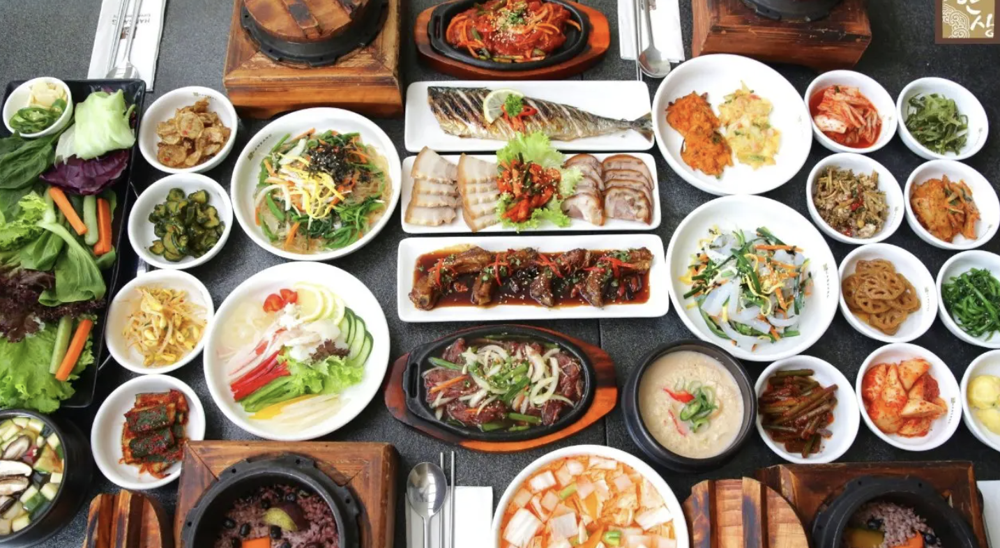
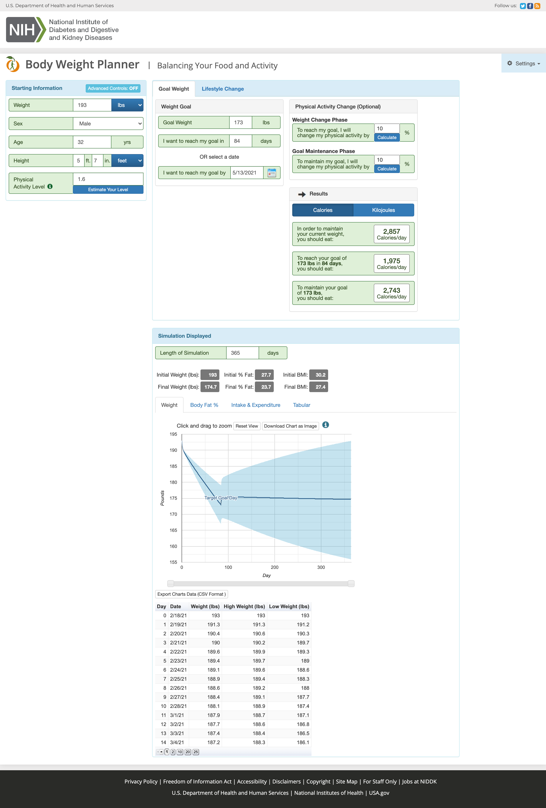

# 减肥，看着一篇就够了，营养师带你了解什么是减肥

## 了解胖的真相

把人体作为一个容器，你经常往里面塞东西，但又不常常把里面的东西清理出一些来。容器只能越来越大, 你就胖了。 当容器发现他并没有太多东西需要储存，容器就自然的变小了。 

胖，就是你吃的能量太多，导致身体可吸收的能量太多，当身体吸收了过多的能量，又不能释放掉，那么能量就会转换成质量,你就胖了。 

## 变瘦的真相

**创造能量缺口，把身体的质量变成能量消耗掉。** 

减肥变瘦是简单到不能再简单的事情，甚至达到无聊的水平。 因为减肥只有一个方法，创造能量缺口。 几乎所有的减肥方式都是基于这个基础。 其他的方式只是变种，变得让大家能更好，更有效的接受和执行减肥的计划。   

## 那么简单，为什么很多人减肥失败

因为很多时候，大家并没有能够真正的持续的创造出能量缺口。

主要的原因：

1. 减肥没有真正的动力。 

   很多人知道要减肥，但是很多并不知道减肥的目的是什么。 我见过减肥很成功的人，都是胖到有身体疾病（高血压等）要么减肥要么死。找到自己减肥的目的，才能更持久的坚持下去。   

2. 没有目标 目标需要很明确。目标不易于过于模糊或者过于夸大。 模糊的目标如：我要像金钟国那样健壮。夸大的目标：5天瘦20斤。 
3. 没有计划 没有目标也就没有计划。有些有目标，但是计划和目标没有关系。导致执行计划和目标无法同一起来。 比如，目标5天瘦20斤， 计划是 少吃多动。  计划远远无法完成目标。所以从一开始，就输了。  
4. 敌人太强大

 

## 营养师是怎么开始减肥的

**勇敢的认清现实，制定目标。** 

图

体重193lb, 计划减20lb。

**查询自身的基础代谢**

google TDEE（Total Daily Energy Expenditure\) ， 超多网站提供查询基础代谢，但是由于基础代谢有几种不同的算法，所以你会有不同的结果。 这些都是estimate的结果，所以需要在执行计划中不断的去调整，找到自己真正的基础代谢值。  美国NIH（National Institutes of Health）提供**Body Weight Planner** 里面有TDEE的计算



我的NIH Body Weight Planner

**设定目标**

减太多，太快伤身体， 太慢没动力。 

一般推荐 每周减0.5%-1%的体重。 也就是说，我的体重193lb 一周可以减1-2lb。

如果要减20lb，那就要10周左右。那我设定的是12周的时间。

减太快的问题： 脂肪的分解会产生毒素，如果减太快，如果毒素超出人体可控范围，那么人可能会出现病态，比如长痘痘。  同时，实验证明，在减肥过程中，尤其有节食的过程中。会产生大量尿酸，平时有高尿酸，痛风的，可能需要注意。以防止痛风打乱计划。 其次，减的很快的前提的，巨大的能量缺口，这会导致基础代谢的快速下降，影响持续减肥效果。所以10天减20斤，爆痘痘，天天拉肚子。 

**设定每天能量摄入量**

一般认为 

7 calories  = 1g  

500g = 3500 calories

1000g = 7000 calories

所以你要瘦2斤，一周内要减少3500~7000 卡路里。 平均每天500 ~1000卡路里。 

所以的摄入量基本在2000 卡路里一天

如果2000卡路里一天，减的太慢，那么久再减少100卡路里，到1900卡路里一天。

如果减的太快，那么就加100卡路里的摄入量。通过这样的调整，达到最合适的卡路里摄入量值。

所以，在没有提高你运动的需求下，我们可以单单通过饮食就可以保证让你每周减1-2斤。

**重点重点**

**规划蛋白质，脂肪和碳水的摄入目标。** 

有很多饮食方法，比如低碳，Keto（高脂肪）的饮食方式。 我使用的是高蛋白，控制碳水和脂肪的方式。 

原因是，高蛋白质饮食可以达到减脂不减肌肉，同时研究认为，高蛋白质饮食没有太多副作用。 

* 3 to 5 g/kg/day \(1.3 to 2.2 g/lbs/day\) for general population and athletes who partake in low-volume training or mostly skill-based training

所以 193lb \(87kg\) 需要 191克蛋白质。 191克蛋白质等于800（191\*4）卡路里

脂肪推荐: 脂肪占20%~35%总卡路里。所以2000卡中有400~700卡是脂肪。 1克脂肪9卡路里，那么一天脂肪消耗在44g到77克。脂肪最好不要少于20%，会阳痿。脂肪能促进荷尔蒙，所以尽量降低脂肪摄入，但是也要维持一定的摄入量。

所以剩下，500卡到800卡。 等于125g~200g的碳水。 

这样我2000ka 需要的蛋白质，脂肪和碳水就出来了。 

蛋白质： 191g

碳水: 125g~200g

脂肪：44g~77g

设定食谱

\*\*\*\*

