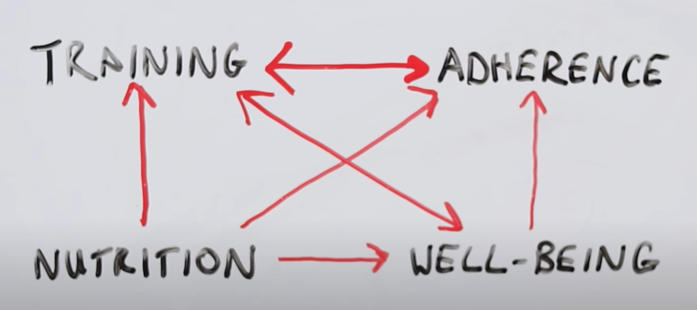
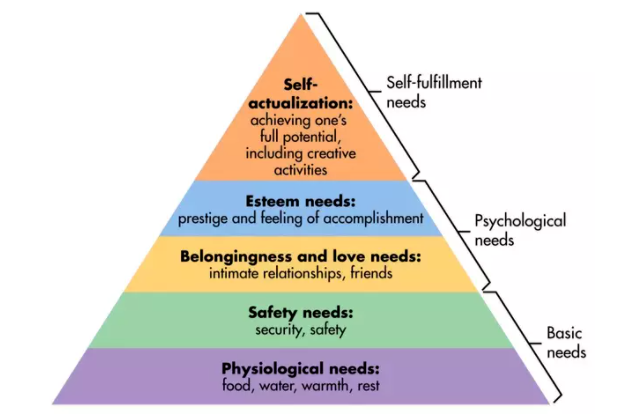
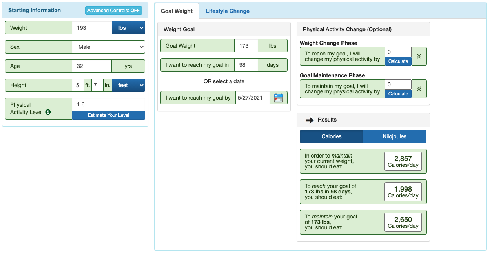

# 减肥，看着一篇就够了，营养师带你了解什么是减肥

## 了解胖的真相

人的体重遵循能量守恒定律，胖其实就是摄入的能量大与消耗的能量，多余的能量就堆积储存起来了。 

## 变瘦的真相

变瘦的真相就是：控制摄入能量，增加消耗的能量。 换句话就是 **创造能量缺口，把身体的质量变成能量消耗掉。** 

**减肥是什么**

我比较喜欢Joe Delaney 所说的4要素。 训练，营养，坚持和开心的状态。 

训练：使你的身体看起来线条更加完美。 

营养： 一定程度上已经决定了你能否减肥成功。 

坚持：减肥之路漫漫，坚持决定了你减肥的效果。 

开心的状态：  各种研究表明，时刻保持开心状态的人，减肥效果更好。 

  

## 为什么很多人减肥失败

根本原因是，大家并没有能够真正的持续的创造出能量缺口。

主要的原因：

1. 减肥没有真正的动力，缺少持久动力，半途而废。

   很多人知道要减肥，但是很多并不知道减肥的目的是什么。 我见过减肥很成功的人，都是胖到有身体疾病（高血压等）要么减肥要么死那种。只有正视自己，找到减肥的目的，才能更持久的坚持下去。   

2. 没有目标  
   定目标不容易。目标不易于过于模糊或者过于夸大。 模糊的目标如：我要像金钟国那样健壮。夸大的目标：5天瘦20斤。于模糊或者过于夸大都导致无法执行。

  

3. 没有计划 很多人的减肥计划不过完善，往往和目标脱钩。 比如，我要10天减1斤，计划是多动少吃，天天去健身房。 这样的计划并不能保证你的减肥效果，而且不够科学，也难以坚持。真正完善的计划，从纸面上就已经能科学的计算出，每周能减的体重，只要按照计划执行，就能达到效果，并且可以复制。 
4. 敌人太强大，都在图片里。 

 

## 营养师是如何用科学方式计算出在一周内想要减的重量，而且不需要额外运动。

**方法：**

**减轻的体重 =  摄入能量 - 基础代谢** 

**例如：我是如何计算出一周减肥1.6斤的？**

**我的基础代谢是 2800卡路里。 每天摄入能量控制在2000卡路里。 能量缺口是800卡路里。**

摄入能量 2000cal  -  基础代谢2800 cal =  能量缺口800 cal 

**一周的能量缺口就是5600卡路里。** 

能量缺口800 cal \* 7 = 周能量缺口5600 cal 

**1克蛋白质=4卡路里，1克脂肪=9卡路里，1克碳水=4卡路里, 一般认为7卡路里=1g。**

**计算出5600cal 等于多少克体重。**

周能量缺口5600 cal  / 7 = 800 克

一周能减1.6斤（800克）

所以只要坚持控制每天卡路里的摄入量，就能达到每周减重1.6斤。

## 介绍减肥计划的制定

### 1.目的

目的因人而异，但需要一个能给你带来比较大动力的目的。可以通过尝试马斯洛需求金字塔来寻找。越顶上的需求能带给更大的动力。

### 2. 目标

目标需要明确， 一般包含时间和减重目标。 比如我设定的目标为14周减重20磅。

一般推荐 每周减0.5%-1%的体重。 我的体重193磅，那么一周可以减1-2lb，大体上14周可以减14磅到28磅，平均值为21磅。

**目标设太大（快速减肥）的的问题：容易生病，且无法长期坚持**

 脂肪的分解会产生毒素，如果减太快，如果毒素超出人体可控范围，那么人可能会出现病态，比如长痘痘。  

实验证明，在减肥过程中，尤其有节食的过程中。会产生大量尿酸，平时有高尿酸，痛风的，可能需要注意。以防止痛风打乱计划。 

其次，减的很快的前提的，巨大的能量缺口，这会导致基础代谢的快速下降，影响持续减肥效果。

**目标设太小（慢速减肥）的的问题：这可能不是问题，可能没有人会这样做。** 

\*\*\*\*

**3. 计算目标**

**查询自身的基础代谢**

google TDEE（Total Daily Energy Expenditure\) ， 超多网站提供查询基础代谢，但是由于基础代谢有几种不同的算法，所以你会有不同的结果。 这些都是estimate的结果，所以需要在执行计划中不断的去调整，找到自己真正的基础代谢值。  美国NIH（National Institutes of Health）提供**Body Weight Planner** 里面有TDEE的计算



我的NIH Body Weight Planner 给出的结果是 ：

每天的基础代谢为 2800卡路里，96天（14周）减 20 磅，每天大体能量摄入为2000左右。具体的如何计算得出这个结果可以看上文的介绍。

### **4 规划蛋白质，脂肪和碳水的摄入目标（重点）** 

蛋白质，脂肪，碳水的规划指的会影响到饮食的方法。  有很多饮食方法，比如低碳，Keto（高脂肪）的饮食方式。 我使用的是高蛋白，控制碳水和脂肪的方式。

**规划蛋白质摄入**

**减肥不减肌肉可能么？Yes**

研究表明高蛋白质饮食配合无氧运动，可以达到减脂不减肌肉，同时研究认为，高蛋白质饮食没有太多副作用。

多少蛋白质才能减少肌肉流失呢？

 Several research studies have verified that simultaneous loss of fat and maintenance of lean body mass is possible \(Demling & DeSanti, 2000; Josse, Atkinson, Tarnopolsky, & Phillips, 2011\). This requires **careful consideration of calorie and protein intake** and **alignment with a well-designed resistance training** program. Maintaining as much muscle mass as possible while dieting can be achieved with greater protein intake \(**at least 1.8 to 2.2 grams per kilogram**\) and regular resistance training.

 193lb \(87kg\) 的我, 需要 191克蛋白质。 191克蛋白质等于800（191\*4）卡路里。所以我还可以规划剩下的1200卡路里

**规划脂肪摄入**

脂肪推荐: 脂肪占20%~35%总卡路里。所以2000卡中有400~700卡是脂肪。 1克脂肪9卡路里，那么一天脂肪消耗在44g到77克。脂肪最好不要少于20%，脂肪能促进**荷尔蒙**，所以尽量降低脂肪摄入，但是也要维持一定的摄入量。

**规划碳水摄入**

所以剩下，500卡到800卡。 等于125g~200g的碳水。 

这样我2000卡路里 需要的蛋白质，脂肪和碳水就出来了 

蛋白质： 191g

碳水: 125g~200g

脂肪：44g~77g

### 5 **设定食谱**

设定完蛋白质，碳水，脂肪含量后。就是规划食谱。

这个是比较大的一个topic，而且因人而异。下面是一些推荐的食物，可以做为参考。

一般推荐，多吃鸡肉和鱼肉，他们热量少，脂肪含量少。一天内可以和牛肉或者羊肉组合在一起。

食物推荐：

### 6 记录身体变化，调整计划

推荐一周测体重2~3次，每次尽量在相同的时间点，最好是脱光光测体重。  

体重器如果可以显示肌肉，脂肪，骨骼含量的，可以不用相信，一般机器是无法提供准确是数值的，甚至很多医院也没有相应的仪器，需要到特定的医院才能测出比较精确的值。但是可以做为参考值，记录含量的上下波动。

**6.1 如果减重太快**，

     如果减重太快，需要减缓减重速度，可以增加日常能量摄入量。 

**6.2 如果减重太慢**

   如果减重太慢，需要加快减重速度，可以减少日常能量摄入量。 

**6.3 平台期**

   如果平台期持续4周以上，需要重新做规划。 

   如果平台期在1周到2周左右，可以增加有氧锻炼。 

   平台期一定是会有的。人体是动态变化的，所以我们的计划也得是动态变化。当体重降低了一定程度后，基础代谢等都会有所下降，那么计划的日能量摄入量也需要进行相应的调整。 对于平台期的理解，可以认为是个milestone，是人体从一个状态到达一个更加健康状态的标志，是下个一自我提升的开始。 

### 7 上科技（营养补给）

### 8 运动

### 9 作弊

\*\*\*\*

